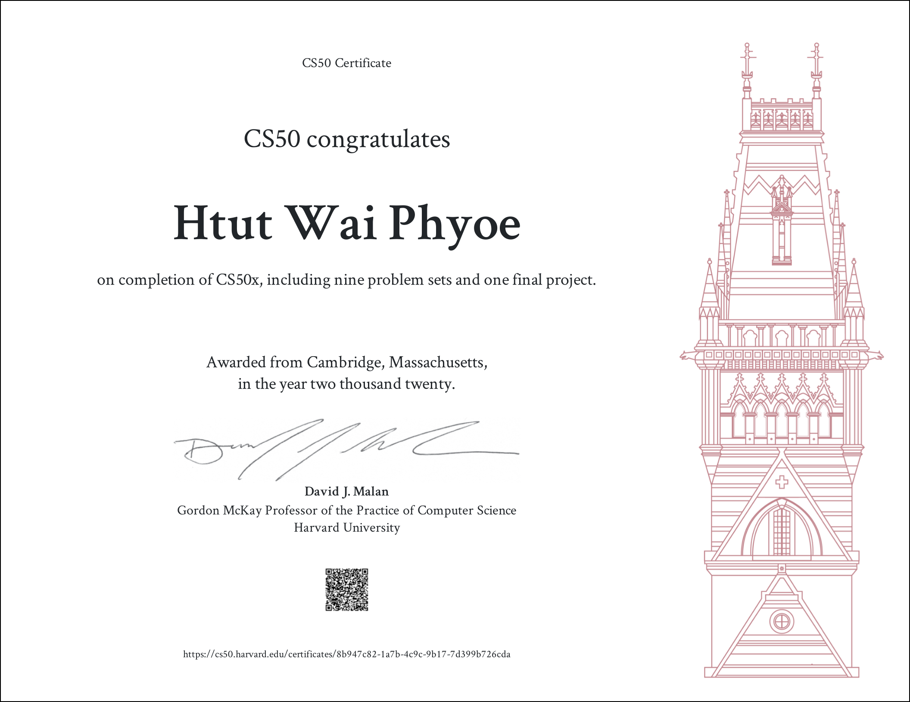

# CS50 - Introduction to Computer Science

## Here is my Journey for CS50x 2020
### DISCLAIMER
You can referenc my answers for your assignments but don't copy the code literally without effort to solve the problems. 

### Week 0 - Scratch
- Pset 0
  - Scratch

### Week 1 - C
- Pset 1
  - Hello
  - Mario (less)
  - Mario (more)
  - Cash
  - Credit

### Week 2 - Arrays
- Pset 2
  - Readability
  - Caesar

### Week 3 - Algorithms
- Pset 3
  - Plurality
  - Runoff

### Week 4 - Memory
- Pset 4
  - Filter (less)
  - Recover

### Week 5 - Data Structures
- Pset 5
  - Speller

### Week 6 - Python
- Pset 6
  - Hello
  - Mario (more)
  - Credit
  - Readability
  - DNA

### Week 7 - SQL
- Pset 7
  - Movies
  - Houses

### Week - 8 Information
- Pset 8 (Web)
  - Finance

### Final Project
- IYO

## Certificate

